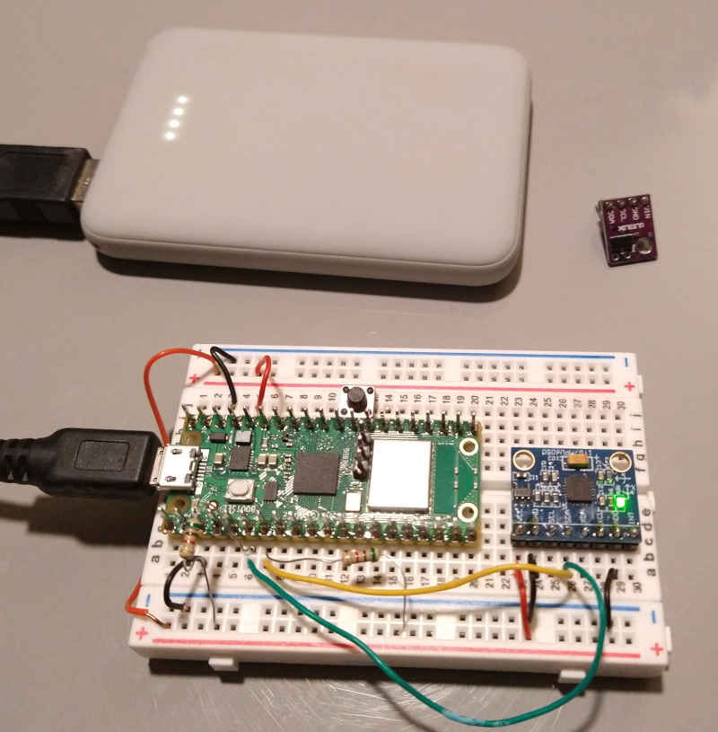
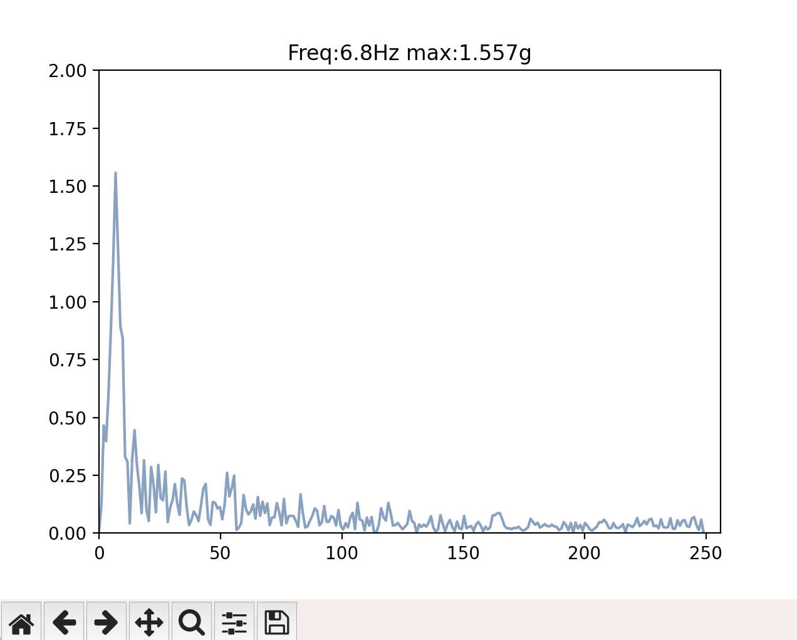
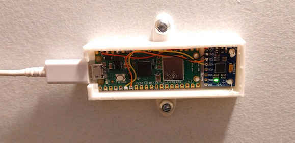

# StairPersonDetector

 
Using a Pico  to detect if somebody  goes up or down the stair 
This is a proof of concept  

Demonstration link to youtube.com <a href=https://youtu.be/534miBv5ut0>https://youtu.be/534miBv5ut0</a> 

- First trial 
 Use A MPU6050 to detect vibration on the stair. 
 I create the code using kiss FFT from https://github.com/AlexFWulff/awulff-pico-playground  
 The MPU6050 functions  are base on the Pico-SDK. I don't use the fifo since it is only the accelerometer  
 I'm doing an 512 points  FFT on 500 samples/sec by interleave of 256 samples. This way I do have faster response. 
 Folder mpu6050_udp. Use mpuPlot to display the spectrum. 
 <a href="https://www.youtube.com/watch?v=534miBv5ut0"> you tube video</a> 
  In conclusion. 
  Walking around the stair trigger the mpu6050 so it is hard to find a good threshold to discriminate. 
  The python script mpuPlot.py will received the data in UDP mode and display the chart. 
  The python library numpy and matplotlib need to be installed. 
  N.B. FSAMP and NSAMP in mpuPlot.py. should be the same as the mpu6050_udp.c 
   

- Second trial using optic. (pico_escalier) 
  This version doesn't use the mpu6050. 
  It uses an I.R. distance indicator check https://github.com/danjperron/VL53L0X_pico 
  folder pico_escalier.   This is the current version using the VL53L0 sensor to turn Light ON/OFF via MQTT 
  <a href="https://youtu.be/ci57-oai_Nk"> you tube video (in french)</a> 
 
 
- Third and last trial !  Return back to mpu6050 and MQTT 
  Fix a bug in sampling rate and since this is only for the night walking around the stair is not an issue. 
  Two thresholds.  The FFT peak threshold and the peak threshold before FFT 
  Folder mpu6050_mqtt 
 
  The output data unit are now 1g = 10000.  This was the best way to incorporate the +/- 2G input 16bits for the UDP.
  I Also add the NTP request for the date
  This is the mqtt command. 

  N.B. add-on Enable/Disable some frequency from the FFT index on Max Peak calculation.
 
    <blockquote>/cmnd/escalier/delay -> delay to let the light ON. 
    /cmnd/escalier/threshold     -> minimum FFT peak detection to trigger the light. 
    /cmnd/escalier/peakthreshold -> minimum FFT peak detection to trigger the light. 
    /cmnd/escalier/info.         -> request to output status. 
    /cmnd/escalier/enable.       ->   0= no light  1= trigger light if threshold is reached. 
    /cmnd/escalier/calibrate     ->   calibrate accelerometer offset for 5 sec. 
    /cmnd/escalier/udpthreshold  -> minimum FFT peak detection to trigger the udp transfer. 
    /cmnd/escalier/udphostip.    -> specification of the IP address to post the UDP packet. 
    ---- add-on  possibility to enable/disable FFT output frequency for threshold calculation. By default is it set to all. 
    ---- where x is the index of the FFT table. the MQTT message set x.  in  mqtt message specify which index or use 'all'. 
    /cmnd/escalier/getmask       -> retreive FFT part index. 
    /cmnd/escalier/setmask       -> enable   FFT[x]. 
    /cmnd/escalier/clrmask       -> disable  FFT[x].</lockquote>
 
  ex: using mosquitto to set udp host IP 
       mosquitto_pub -h "your borker IP" -t "cmnd/escalier/udphostip" -m "192.168.0.1".   or -m "" to disable udp.
  
       
- How to compile 
  from the folder mpu6050_mqtt 
  mkdir build 
  cd build 
  cmake -DPICO_BOARD=pico_w -DWIFI_SSID="your essid" -DWIFI_PASSWORD="your password" .. 
  make 
  copy over the file mpu6050_mqtt.uf2 to the pico in flash mode 
  or use the SWD with openocd on a raspberry Pi 
  openocd -f interface/raspberrypi-swd.cfg -f target/rp2040.cfg -c "program mpu6050_mqtt.elf verify reset exit" 
   
  Don't forget to change the define. in the main file mpu6050_mqtt.c 
   
  #define FSAMP 250         Sample frequency of the mpu6050. The mpu6050 divider will use this (8000/FSAMP) -1 
  #define NSAMP 256         Number of sample points for FFT         
  The CMakeLists.txt file in pico-sdk/src/rp2_common/pico_lwip needs to be modified by adding after line   # MQTT client files 
    <blockquote>add_library(pico_lwip_mqtt INTERFACE)
    target_sources(pico_lwip_mqtt INTERFACE 
            ${PICO_LWIP_PATH}/src/apps/mqtt/mqtt.c
            )</blockquote>  
  
  
  
  
 
